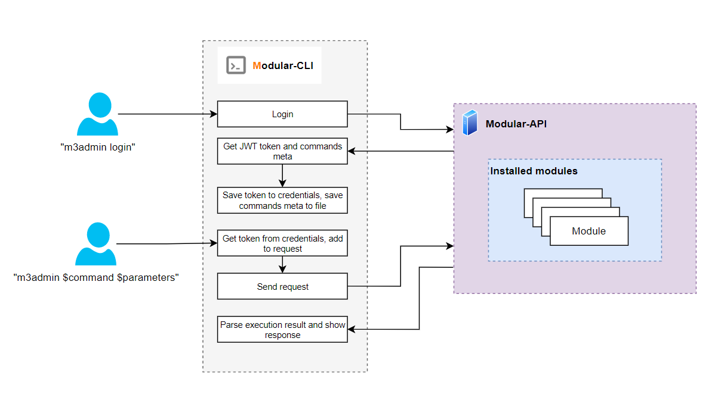

# Modular-CLI
<a name="content"></a>
## Content

1) [General information](#info)
2) [Installation](#install)
3) [Configuration](#configuration)
4) [First run](#first_run)
5) [Autocomplete](#autocomplete)
6) [Modular CLI schema](#schema)
7) [Project information](#project_info)

[Content ↑](#content)

<a name="info"></a> 
## 1. General information
Modular-CLI is the specialized tool for interacting with the [Modular-API](https://git.epam.com/epmc-eoos/m3-modular-admin/-/blob/develop/README.md).
Automatically generate auth token, request body based on received meta from Modular-API and send it 
via HTTP requests.

[Content ↑](#content)
<a name="install"></a>
## 2. Installation

The installation of Modular-CLI assumed that you have Python3.9 and pip installed.
Use the following links to install the tools in case they are not installed.</br>

[Python download page](https://www.python.org/downloads/)

[Pip installation page](https://pip.pypa.io/en/stable/installation/)

<span style="color:red">**NOTE**</span>: 
Due to the best Python practices, it is highly recommended to use virtual 
environment to protect project against dependency breakage.

[Creating Virtual Environments Guide](https://packaging.python.org/en/latest/tutorials/installing-packages/#creating-and-using-virtual-environments)

* Create: `python -m venv modular_cli_venv`  
* Activate (Linux): `source modular_cli_venv/bin/activate`   
  Activate (Windows): `source modular_cli_venv/Scripts/activate`   
* Installation: `pip install .`  

[Content ↑](#content)
<a name="configuration"></a>
## 3. Configuration
By default - entry point for Modular-CLI set as `m3admin` and this name will be used 
in all next commands examples. However, you have ability to customize this name in 
`setup.py` file before Modular-CLI installation:
* open `setup.py` file in any convenient editor
* find property `entry_points` and line `m3admin=modular_cli.modular_cli:modular_cli` in it
* replace `m3admin` keyword with desired name
    

Before first run Modular-CLI should be properly configured. Please create the user
in [Modular-API](https://git.epam.com/epmc-eoos/m3-modular-admin/-/blob/develop/README.md) 
by yourself or ask for support your system administrator. For using 
Modular-CLI you need to know your username, password and link to Modular-API.  
After that use the next command:  
`m3admin setup --username $USER --password $PASSWORD --api_path $LINK_TO_MODULAR_API`  
Please NOTE: Modular-API server should be in running state when `setup` command will be executed

If you would like update access credentials just execute `m3admin setup` command again.    
To delete credentials run `m3admin cleanup` command

#### Optional configuration
The following environment variables could be used:
* `LOG_PATH`: in case you need to store the Modular-cli log file by the custom path.

[Content ↑](#content)
<a name="first_run"></a>
## 4. First run
First step you should do after configuration it is retrieving jwt token for authorization 
and available for your user commands meta.

Execute `m3admin login` - to get fresh jwt token and available commands
```commandline
Response:
Login successful
```
Execute `m3admin` - to see available for your user commands
```commandline
Available modules:
        module_1
        module_2
        ...
        module_N
Available groups:
        group_1
        group_2
        ...
        group_N
Available commands:
        cleanup
        login
        setup
        version
```
Try to execute any available by Modular-API policy command
```commandline
m3admin $module_name $group_name $command_name --$parameter $parameter value
Response:
$Command execution result
```
In every command you can add `--json` or `--table` flag and change output mode.
* If `--json` flag was specified:
```commandline
m3admin $module_name $group_name $command_name --$parameter $parameter value --json
{
    "Status": "SUCCESS",
    "Code": 200,
    "Message": "$Command execution result",
    "Warnings": []
}
```
* If `--table` flag was specified:
```commandline
m3admin $module_name $group_name $command_name --$parameter $parameter value --table
+---------+------+----------------------------------------------------+
|  Status | Code |                      Response                      |
+---------+------+----------------------------------------------------+
| SUCCESS | 200  |             $Command execution result              |
+---------+------+----------------------------------------------------+

```

If you want to extend list of available commands/modules please contact to your system 
administrator with request about adding desired resources.

Commands syntax:  
`m3admin <available commands> <parameters>`  
`m3admin <available modules> <group or command> <parameters>`  
`m3admin <available groups> <subgroup or command> <parameters>`

[Content ↑](#content)
<a name="autocomplete"></a>
## 5. Autocomplete

The user has ability to enable autocompletion feature for Modular-CLI tool.
Autocomplete option available only on Unix-based platforms (bash&zsh interpreters).

To activate it do a few steps:
1. Activate virtual environment by command 
   `source <path_to_venv>/bin/activate`
2. Create SYMLINK to virtual environment 
   `sudo ln -s <your_path_to_venv>/bin/m3admin /usr/local/bin/m3admin`
3. Start a new terminal session
4. Execute command `sudo m3admin enable_autocomplete`
5. Restart terminal session

To deactivate:
1. Execute the `sudo m3admin disable_autocomplete`command
2. Restart terminal session

[Content ↑](#content)
<a name="schema"></a>
## 6. Modular CLI schema



[Content ↑](#content)
<a name="project_info"></a>
## 6. Project information

**Source Code**: https://git.epam.com/epmc-eoos/m3-modular-cli  
**Documentation**: https://git.epam.com/epmc-eoos/m3-modular-cli/-/blob/develop/README.md  
**Changelog**: https://git.epam.com/epmc-eoos/m3-modular-cli/-/blob/develop/CHANGELOG.md  
**Supported Python Version**: 3.9  
**Support**:  Denys_Lykholit@epam.com` 